# HK Compliance RAG — Pipeline Deep Dive

## System Overview

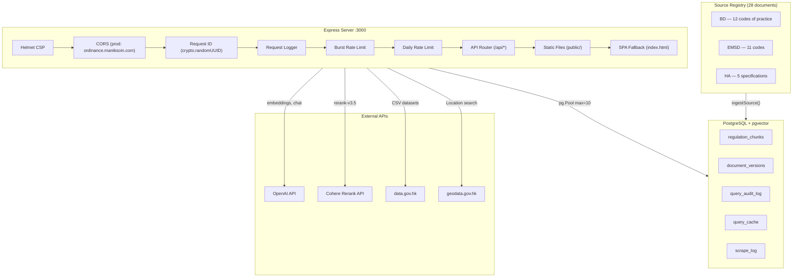

### Server Bootstrap Sequence

`src/server.ts` — Express app starts listening immediately, then initializes background services:

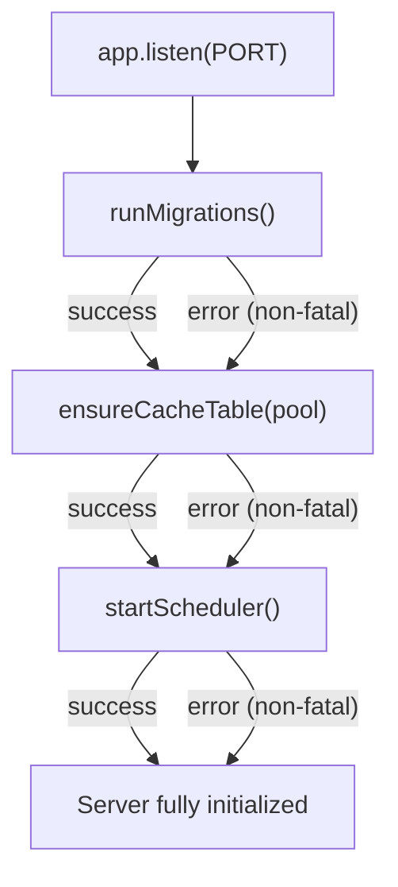

Health checks respond before migrations finish. Every background init step is wrapped in try/catch so a database outage doesn't prevent the server from starting.

### Rate Limiting Architecture

`src/security/rate-limit.ts` — Sliding window + concurrency limiter per client IP.

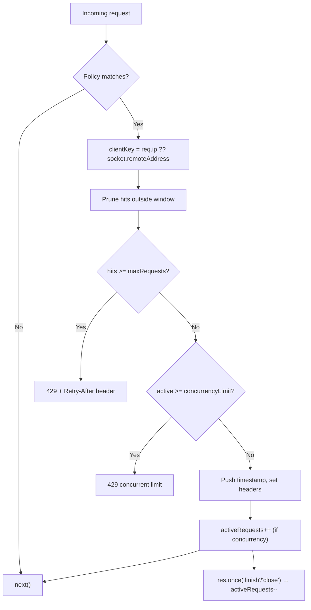

| Policy | Endpoint | Window | Max Requests | Concurrency |
|--------|----------|--------|--------------|-------------|
| `query-minute` | `POST /api/query` | 60s | 8 | 2 |
| `query-stream-minute` | `POST /api/query/stream` | 60s | 4 | 1 |
| `query-daily` | `POST /api/query` | 24h | 50 | — |
| `query-stream-daily` | `POST /api/query/stream` | 24h | 25 | — |

Headers set on every matched response: `RateLimit-Policy`, `RateLimit-Limit`, `RateLimit-Remaining`, `RateLimit-Reset` (and `X-` prefixed duplicates for compatibility).

### Full API Surface

`src/api/routes.ts`

```mermaid
graph TD
    subgraph "Query Endpoints"
        Q1["POST /api/query"]
        Q1 -->|"Synchronous"| QP["queryPipeline()"]
        Q2["POST /api/query/stream"]
        Q2 -->|"SSE streaming"| STREAM["streamAnswer()"]
    end

    subgraph "Health & Metadata"
        H1["GET /api/health"]
        H1 -->|"DB status, chunk count, last scrape"| POOL["pool.query"]
        H2["GET /api/sources"]
        H2 -->|"Per-department stats"| STORE["getSourceStats()"]
        H3["GET /api/documents"]
        H3 -->|"Current versions with PDF URLs"| DV_TABLE["document_versions"]
        H4["GET /api/audit/:id"]
        H4 -->|"Single audit entry"| QAL_TABLE["query_audit_log"]
    end

    subgraph "Admin"
        A1["POST /api/admin/scrape"]
        A1 -->|"Manual change detection"| SCHED_FN["checkForChanges(BD_CODES)"]
        A2["GET /api/admin/costs"]
        A2 -->|"In-memory stats"| COST_FN["getAggregateStats()"]
        A3["GET /api/admin/changes"]
        A3 -->|"Last 30 days"| DV_TABLE2["document_versions"]
    end

    subgraph "Live Data"
        L1["GET /api/live/freshness"]
        L1 -->|"HEAD requests to source URLs"| FRESH["checkBulkFreshness()"]
        L2["GET /api/live/new-circulars"]
        L2 -->|"Probe BD/FSD URL patterns"| CIRC["detectNewBDCirculars() + detectNewFSDCirculars()"]
        L3["GET /api/live/status"]
        L3 -->|"Combined dashboard"| ALL["freshness + circulars + chunk count"]
    end

    subgraph "Government Open Data"
        G1["GET /api/gov/summary"]
        G2["GET /api/gov/fire-doorsets"]
        G3["GET /api/gov/fire-glazing"]
        G4["GET /api/gov/fire-stop-materials"]
        G5["GET /api/gov/mic-systems"]
        G6["GET /api/gov/fire-safety"]
        G7["GET /api/gov/location?q="]
        G1 --> GOVDATA["data.gov.hk CSV (10-min TTL cache)"]
        G2 --> GOVDATA
        G3 --> GOVDATA
        G4 --> GOVDATA
        G5 --> GOVDATA
        G6 --> GOVDATA
        G7 --> GEO["geodata.gov.hk REST API"]
    end
```

**Streaming endpoint differences** (`POST /api/query/stream`):
- Sets `Content-Type: text/event-stream`, `Cache-Control: no-cache`, `Connection: keep-alive`
- Skips query expansion for faster TTFB
- Sends SSE events: `status` → `sources` (with PDF URLs from `document_versions`) → `token` (per chunk) → `web_sources` → `done`
- Uses `hybridSearch` with `topK: 12` then `rerank` with `topK: 6` (vs sync endpoint's default 5)

---

## Part 1: Ingest Pipeline

**Entry point:** `src/pipeline/ingest.ts` — `ingestSource(source, options?)`

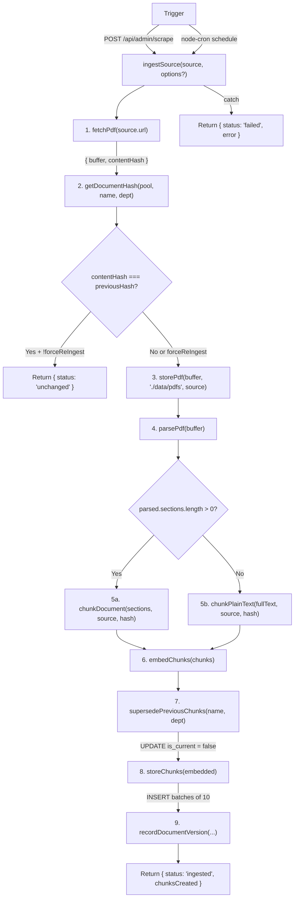

**Batch ingestion** (`ingestSources`): Processes sources in batches of `concurrency` (default 2) via `Promise.all`. Logs progress after each batch: `[Ingest] Progress: N/total`.

**Return type** for every source:
```typescript
{
  source: RegulationSource;
  status: 'ingested' | 'unchanged' | 'failed';
  chunksCreated: number;
  contentHash: string;
  error?: string;      // only if failed
  durationMs: number;
}
```

---

### Step 1: Source Registry

**Files:** `src/sources/buildings-dept.ts`, `src/sources/emsd.ts`, `src/sources/housing-authority.ts`, `src/sources/e-legislation.ts`

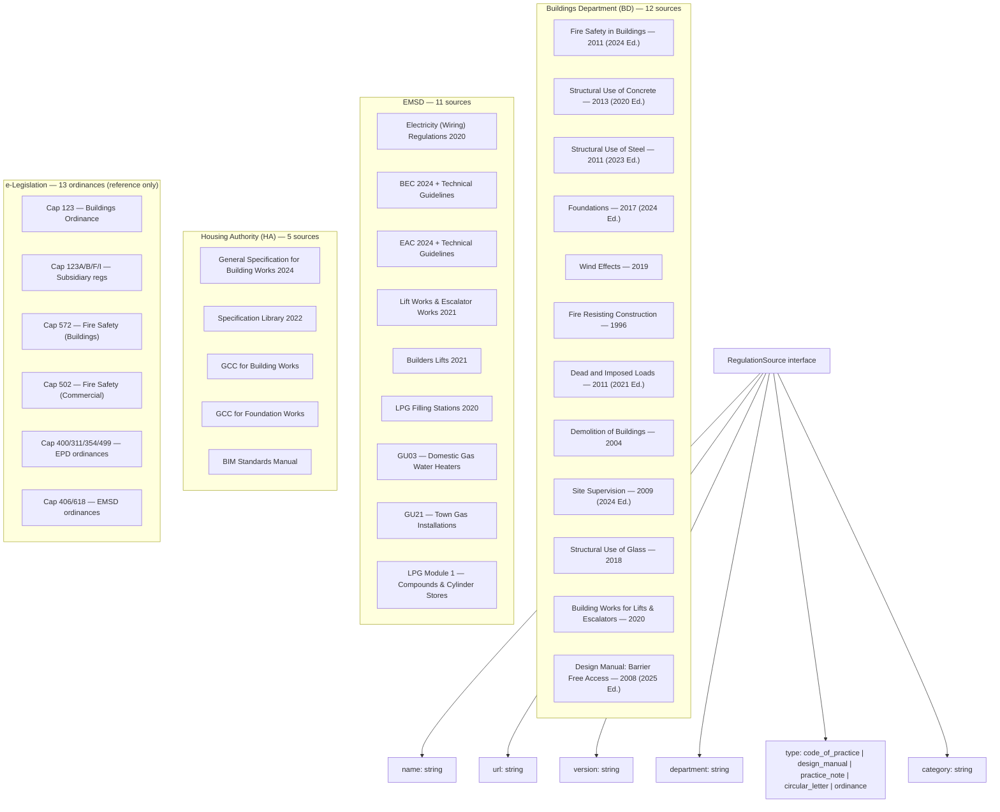

All PDF URLs point to `.gov.hk` domains. The `BD_BASE` is `https://www.bd.gov.hk`, `EMSD_BASE` is `https://www.emsd.gov.hk`, `HA_BASE` is `https://www.housingauthority.gov.hk`.

The `BD_PNAP_INDEX` URL (`bd.gov.hk/.../practice-notes-and-circular-letters/index.html`) is used by the scraper's `discoverPnapUrls()` to dynamically find PNAP PDFs by parsing the HTML for `href` attributes matching `*.pdf`.

---

### Step 2: PDF Fetching & Change Detection

**File:** `src/scraper/index.ts`

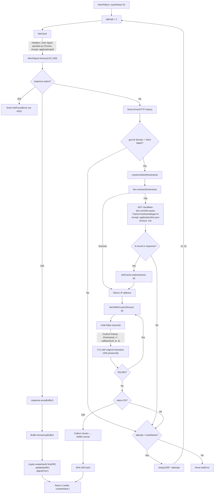

**Why the DoH fallback exists:** `.gov.hk` DNS resolution frequently fails from non-HK networks. The Cloudflare DoH endpoint (`cloudflare-dns.com/dns-query`) provides a reliable alternative. The resolved IP is cached in an in-memory `Map<string, string>` to avoid repeated lookups.

**Why custom DNS fetch uses `node:https`:** The global `fetch()` API doesn't support custom DNS resolution. By using `node:https` with a custom `lookup` function, we can point the TCP connection at the DoH-resolved IP while keeping the original hostname in the TLS SNI extension (so the server's certificate validates correctly).

**Local PDF storage** (`storePdf`):
- Creates `./data/pdfs/` directory (recursive)
- Filename: `${department}_${safeName}.pdf` where `safeName` strips non-alphanumeric chars and replaces spaces with underscores
- Buffer written directly via `fs.writeFile`

**PNAP discovery** (`discoverPnapUrls`):
- Fetches the BD PNAP index HTML page
- Regex: `/href=["']([^"']*\.pdf)["']/gi`
- Resolves relative URLs against `https://www.bd.gov.hk`
- Deduplicates with `new Set()`

---

### Step 3: PDF Parsing

**File:** `src/parser/index.ts`

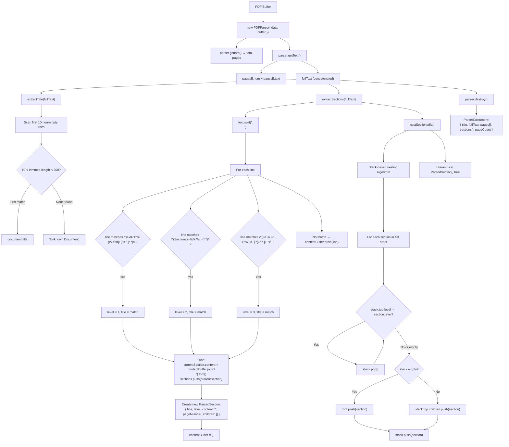

**Page number estimation** (`estimatePageNumber`):
```typescript
const pos = fullText.indexOf(line);
const textBefore = fullText.slice(0, pos);
const pageBreaks = (textBefore.match(/\f/g) || []).length;
return pageBreaks + 1;
```
Counts form feed characters (`\f`, ASCII 12) — most PDF-to-text converters emit these at page boundaries. Returns 1 if the line isn't found or no form feeds exist.

**Nesting example:**

Input (flat):
```
PART I (level 1)
  Section 1 (level 2)
    1.1 Scope (level 3)
    1.2 General (level 3)
  Section 2 (level 2)
PART II (level 1)
```

When `Section 2` arrives (level 2): stack contains `[PART I, Section 1, 1.2 General]`. Pop `1.2 General` (level 3 >= 2), pop `Section 1` (level 2 >= 2), stop at `PART I` (level 1 < 2). Attach `Section 2` as child of `PART I`.

Output:
```
PART I
├── Section 1
│   ├── 1.1 Scope
│   └── 1.2 General
└── Section 2
PART II
```

---

### Step 4: Structure-Aware Chunking

**File:** `src/chunker/index.ts`

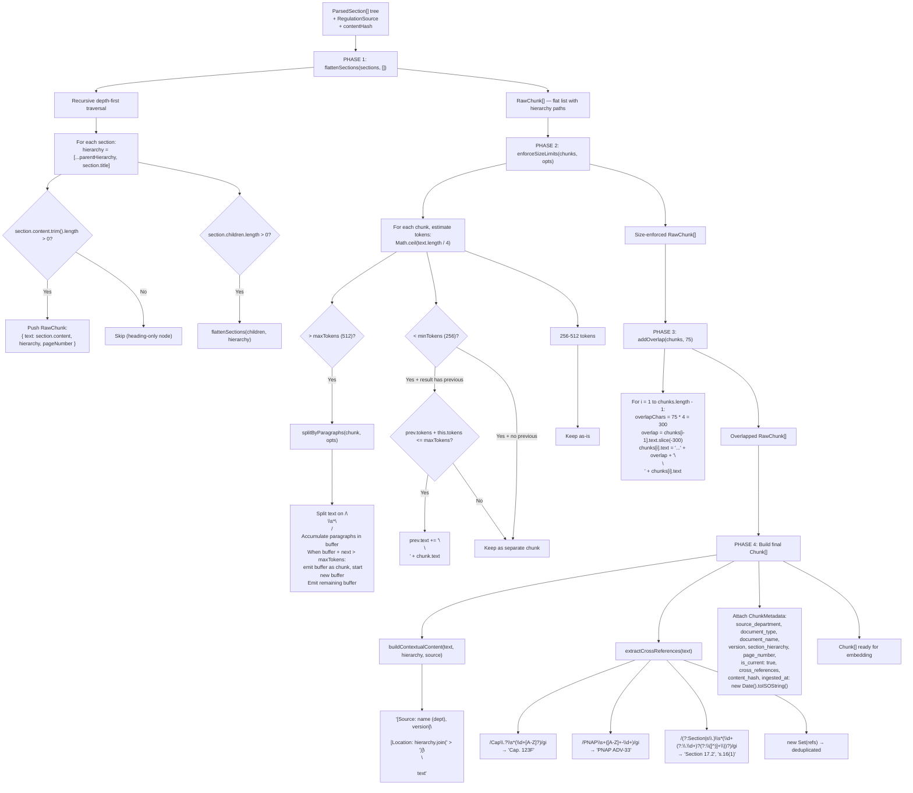

**Token estimation rationale:** `Math.ceil(text.length / 4)` — English text averages ~4 characters per token with GPT tokenizers. This avoids the overhead of running a real tokenizer on every chunk boundary check. The 256-512 token range maps to roughly 1024-2048 characters.

**Default configuration:**

| Parameter | Value | Char equivalent | Purpose |
|-----------|-------|-----------------|---------|
| `minTokens` | 256 | ~1024 chars | Prevent fragments too small to embed meaningfully |
| `maxTokens` | 512 | ~2048 chars | Keep within embedding model's sweet spot |
| `overlapTokens` | 75 | ~300 chars | Context continuity at chunk boundaries |

**Why structure-aware splitting matters:** Naive fixed-size chunking would cut mid-clause, losing the relationship between a regulatory requirement and its qualifying conditions. By splitting along Part/Section/Clause boundaries first, each chunk is a semantically complete unit. Size enforcement only kicks in when a single clause exceeds 512 tokens (split by paragraph) or falls under 256 tokens (merge with neighbor).

**Overlap mechanics:** The `...` prefix on overlapped chunks serves two purposes:
1. Signals to the embedding model that this is a continuation (not a standalone text)
2. The 300-char overlap ensures that if a query matches content near a chunk boundary, both the preceding and following chunks will have the relevant text and can be retrieved

**Contextual header example:**
```
[Source: Code of Practice for Fire Safety in Buildings (BD), 2011 (2024 Edition)]
[Location: PART III Fire Safety Design > Section 4 Means of Escape > 4.2.1 General Requirements]

The minimum width of any exit route shall not be less than 1050mm for buildings
exceeding 30 storeys. For buildings not exceeding 30 storeys, the minimum width
shall not be less than 1050mm for domestic buildings...
```

This header is embedded with the chunk text, so embedding vectors capture source/location context — a query about "fire safety exit width" will retrieve chunks from the fire safety code's means-of-escape section with higher cosine similarity.

**Plain text fallback** (`chunkPlainText`):
- Used when `parsePdf` returns `sections.length === 0` (unstructured PDF without recognizable headings)
- Splits on `\n\s*\n` (paragraph boundaries)
- Same accumulate-until-maxTokens logic as `splitByParagraphs`
- Empty hierarchy `[]` for all chunks
- `pageNumber` defaults to 1
- Same overlap, contextual header, and cross-reference extraction

---

### Step 5: Embedding

**File:** `src/embedder/index.ts`

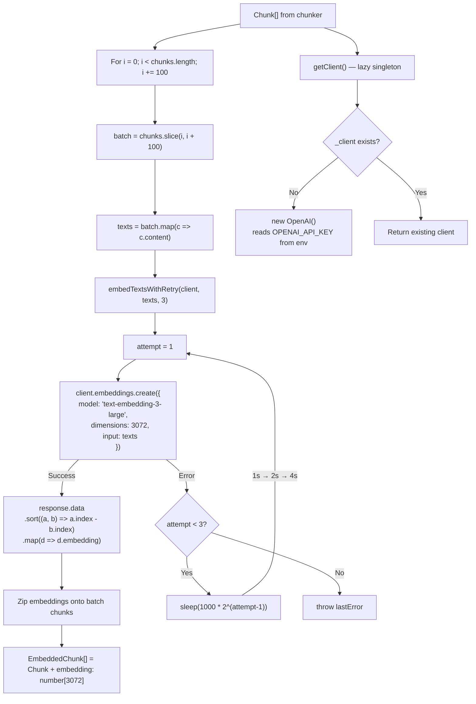

| Parameter | Value |
|-----------|-------|
| Model | `text-embedding-3-large` |
| Dimensions | 3072 |
| Batch size | 100 chunks per API call |
| Max retries | 3 |
| Backoff schedule | 1s, 2s, 4s (exponential) |

**Why sort by index:** The OpenAI embeddings API doesn't guarantee response ordering matches input ordering. Sorting by `response.data[].index` ensures the 57th input text gets the 57th embedding vector.

**Lazy client:** `new OpenAI()` reads `OPENAI_API_KEY` from environment. Creating it lazily in `getClient()` means the module can be imported without the env var being set (useful for tests with mocked clients).

The same `embedQuery(query)` function is used later in the query pipeline for single-string embedding (batch size 1, same retry logic).

---

### Step 6: Storage & Versioning

**File:** `src/db/store.ts`

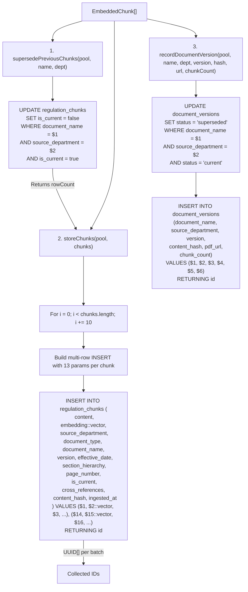

**Embedding serialization:** The `number[]` vector is serialized as `[0.123,0.456,...]` string and cast with `::vector` in SQL. pgvector handles the parsing.

**Batch insert sizing:** 10 chunks per INSERT statement (not 100 like embedding). Each chunk has 13 parameters, so a batch of 10 = 130 SQL parameters. This keeps individual queries manageable while still being much faster than single-row inserts.

**Auto-generated database columns** (from `src/db/migrate.ts`):
- `id UUID DEFAULT gen_random_uuid()` — primary key
- `search_vector TSVECTOR GENERATED ALWAYS AS (to_tsvector('english', content)) STORED` — PostgreSQL automatically maintains the FTS index whenever `content` changes, no application code needed
- `ingested_at TIMESTAMPTZ DEFAULT NOW()` — fallback if not provided

**Versioning strategy:**
1. Old chunks: `is_current = false` (soft delete — old data remains queryable if `is_current` filter is overridden)
2. Old version: `document_versions.status = 'superseded'`
3. New chunks: `is_current = true` (default)
4. New version: `document_versions.status = 'current'` (default)
5. All query-time searches include `AND is_current = true` unless the caller explicitly passes `isCurrent: false`

---

### Step 7: Scheduled Change Detection

**File:** `src/scheduler/index.ts`

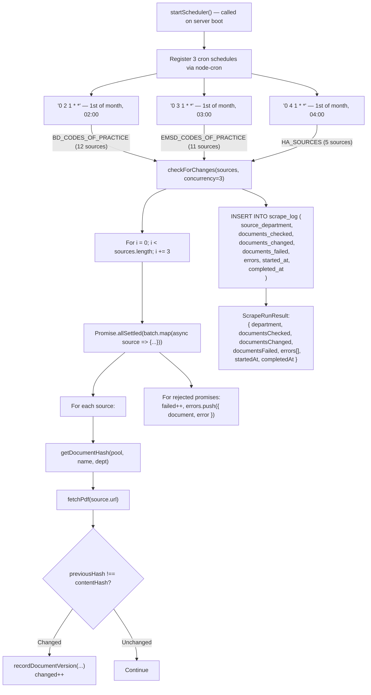

| Schedule | Sources | Count | Cron | Runs at |
|----------|---------|-------|------|---------|
| BD Codes of Practice | `BD_CODES_OF_PRACTICE` | 12 | `0 2 1 * *` | 1st of month, 2:00 AM |
| EMSD Codes of Practice | `EMSD_CODES_OF_PRACTICE` | 11 | `0 3 1 * *` | 1st of month, 3:00 AM |
| HA Specifications | `HA_SOURCES` | 5 | `0 4 1 * *` | 1st of month, 4:00 AM |

**Why `Promise.allSettled`:** Individual source failures (DNS timeout, 404, server error) must not abort the entire batch. `allSettled` runs all sources and collects both fulfilled and rejected results. Errors are logged to `scrape_log.errors` as JSONB for later inspection.

**Note:** `checkForChanges` only detects changes and records new versions — it does not re-ingest (no parse/chunk/embed). The admin endpoint `POST /api/admin/scrape` calls the same function. Full re-ingestion must be triggered separately via `ingestSource` with `forceReIngest: true`.

---

## Part 2: Query Pipeline

**Entry point:** `src/pipeline/query.ts` — `queryPipeline(pool, query, options?)`

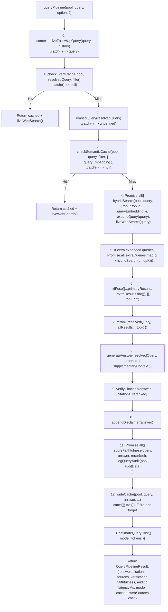

**Options:**
```typescript
{
  filter?: { department?, documentType?, capNumber?, isCurrent? };
  history?: { role: 'user' | 'assistant', content: string }[];
  useQueryExpansion?: boolean;  // default: true
  useReranker?: boolean;        // default: true
  skipFaithfulness?: boolean;   // default: false
  topK?: number;                // default: 5
}
```

---

### Step 1: Input Validation & Injection Detection

**File:** `src/safety/guardrails.ts`

```mermaid
graph TD
    RAW["Raw request body (unknown)"]
    RAW --> ZOD["queryInputSchema.safeParse(raw)"]

    ZOD --> QUERY_V["query: z.string().min(5).max(500)"]
    ZOD --> HIST_V["history?: z.array({
  role: z.enum(['user', 'assistant']),
  content: z.string().min(1).max(8000)
}).max(12)"]
    ZOD --> FILTER_V["filter?: {
  department?: 'BD' | 'FSD' | 'EPD' | 'EMSD' | 'HA',
  documentType?: 'code_of_practice' | 'design_manual' |
    'practice_note' | 'circular_letter' | 'ordinance',
  capNumber?: string
}"]

    ZOD -->|"Parse error"| INVALID["{ valid: false, error: first issue message }"]

    ZOD -->|"Parse OK"| INJECT["detectInjection(parsed.data.query)"]
    INJECT --> PATTERNS["Test query against 22 regex patterns"]

    PATTERNS --> PAT1["/ignore\\s+(all\\s+)?previous\\s+instructions/i"]
    PATTERNS --> PAT2["/disregard\\s+(all\\s+)?prior\\s+(instructions|rules|context)/i"]
    PATTERNS --> PAT3["/you\\s+are\\s+now\\s+(a|an|the)\\s+/i"]
    PATTERNS --> PAT4["/forget\\s+(all\\s+)?your\\s+(instructions|rules|training)/i"]
    PATTERNS --> PAT5["/new\\s+instruction[s]?\\s*:/i"]
    PATTERNS --> PAT6["/system\\s*prompt\\s*:/i"]
    PATTERNS --> PAT7["/\\bDAN\\b.*\\bmode\\b/i"]
    PATTERNS --> PAT8["/jailbreak/i"]
    PATTERNS --> PAT9["/bypass\\s+(your\\s+)?(safety|restrictions|rules|filters)/i"]
    PATTERNS --> PAT10["/pretend\\s+(you\\s+)?(are|to\\s+be)/i"]
    PATTERNS --> PAT11["/roleplay\\s+as/i"]
    PATTERNS --> PAT12["/act\\s+as\\s+(if|a|an|the)/i"]
    PATTERNS --> PAT13["/override\\s+(your\\s+)?(system|instructions|rules)/i"]
    PATTERNS --> PAT14["/\\[INST\\]/i"]
    PATTERNS --> PAT15["/\\<\\|im_start\\|\\>/i"]
    PATTERNS --> PAT16["/\\<system\\>/i"]
    PATTERNS --> PAT17["/<\\/?(?:system|human|assistant)>/i"]
    PATTERNS --> PAT18["/base64_decode/i"]
    PATTERNS --> PAT19["/eval\\s*\\(/i"]
    PATTERNS --> PAT20["/exec\\s*\\(/i"]
    PATTERNS --> PAT21["/import\\s+os/i"]
    PATTERNS --> PAT22["/subprocess/i"]
    PATTERNS --> PAT23["/\\\\x[0-9a-f]{2}/i"]

    INJECT -->|"Any match"| BLOCKED["{ valid: false,
error: 'Query contains disallowed content',
injectionDetected: true }"]

    INJECT -->|"No matches"| SANITIZE["sanitizeInput(query + history)"]
    SANITIZE --> STRIP["Remove control chars:
/[\\x00-\\x08\\x0b\\x0c\\x0e-\\x1f\\x7f]/g → ''
.trim()"]
    STRIP --> VALID["{ valid: true, data: sanitized QueryInput }"]
```

The injection patterns cover: prompt override attempts, role impersonation, markup injection (`[INST]`, `<|im_start|>`, `<system>`), code execution patterns (`eval(`, `exec(`, `import os`, `subprocess`), and hex escape sequences.

---

### Step 2: Follow-up Context Resolution

**File:** `src/retrieval/follow-up-context.ts`

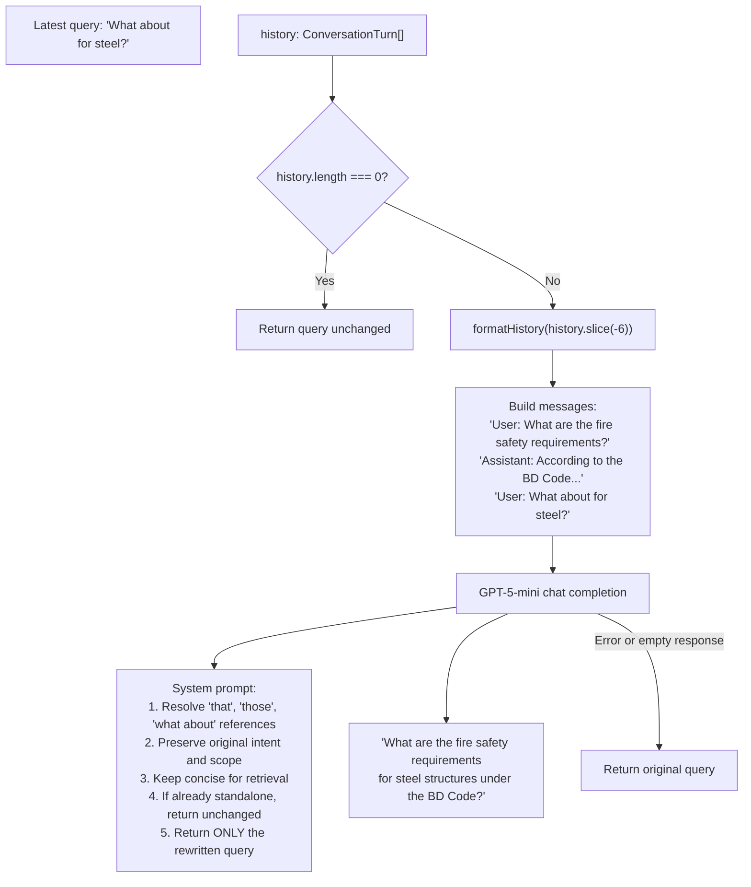

The `.catch(() => query)` in the pipeline ensures any LLM failure gracefully falls back to the raw user query.

---

### Step 3: Two-Tier Query Cache

**File:** `src/cache/semantic-cache.ts`

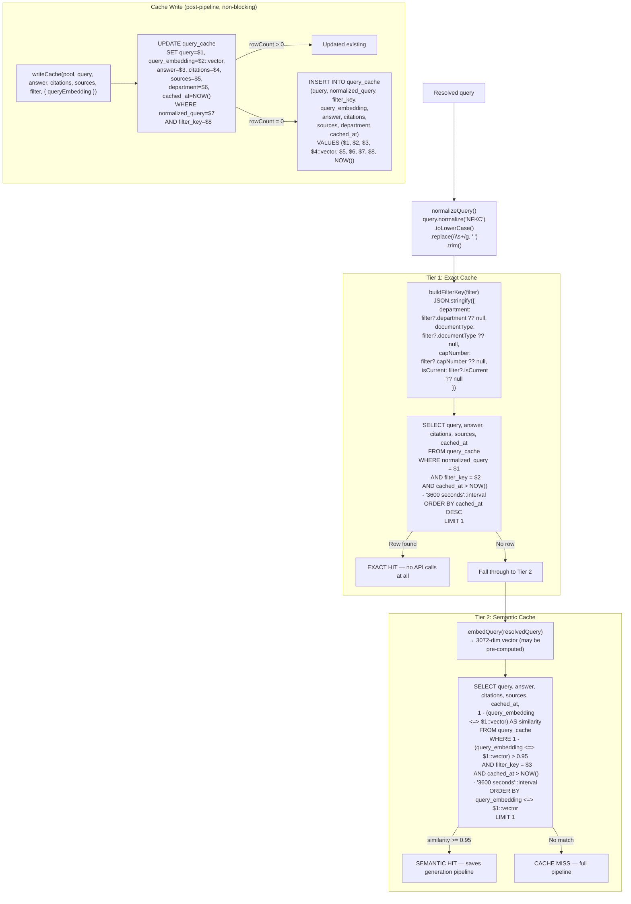

| Parameter | Value |
|-----------|-------|
| Cosine similarity threshold | 0.95 |
| TTL | 3600 seconds (1 hour) |
| Filter isolation | Responses cached per `{department, documentType, capNumber, isCurrent}` combo |
| Semantic index | `HNSW (query_embedding vector_cosine_ops)` |
| Exact index | `B-tree (normalized_query, filter_key, cached_at DESC)` |
| Speedup | ~500x (15ms cached vs ~8s full pipeline) |

Both cache hits still run `liveWebSearch()` to supplement with fresh government data links.

All cache operations are wrapped in try/catch returning null on error — cache is never in the critical path.

---

### Step 4: Query Expansion

**File:** `src/retrieval/query-expansion.ts`

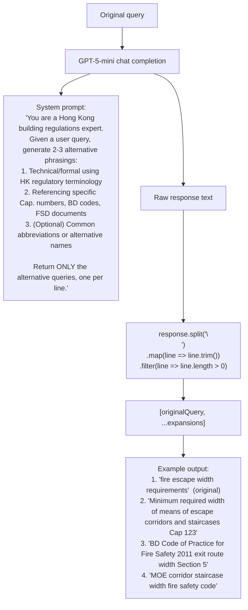

Runs concurrently with primary `hybridSearch` and `liveWebSearch` via `Promise.all`. The expanded queries (minus the original) each trigger their own `hybridSearch` call, and all results are fused together via RRF.

---

### Step 5: Hybrid Retrieval (Vector + BM25 + RRF)

**File:** `src/retrieval/hybrid-search.ts`

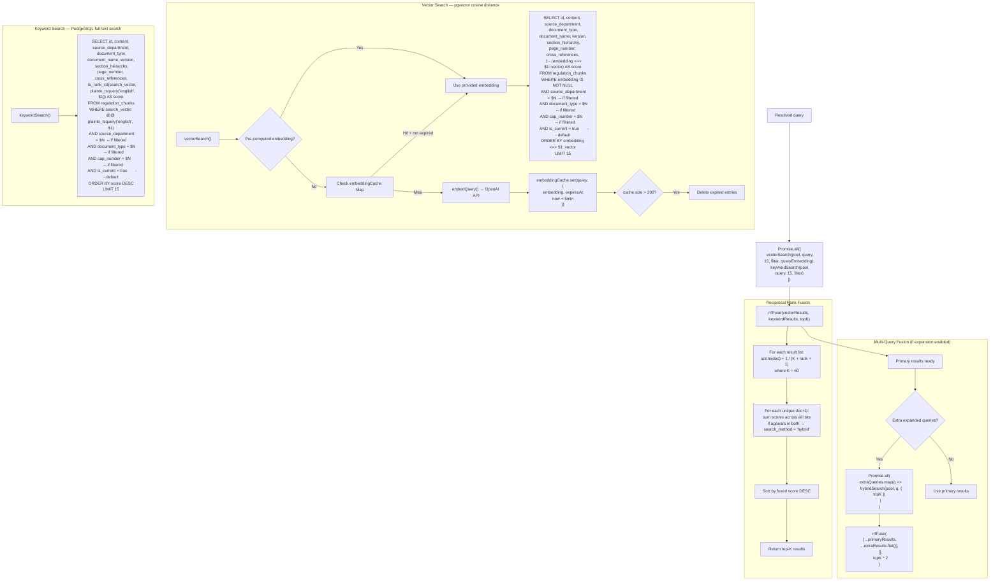

**Filter clause construction** (`buildWhereClause`): Dynamically appends parameterized `AND` clauses based on which filter fields are set. Parameter indices are tracked to avoid collisions with the embedding/query parameter. If `isCurrent` is not specified, `AND is_current = true` is always added.

**RRF scoring example:**
- Doc A: rank 0 in vector, rank 2 in keyword → score = `1/(60+1) + 1/(60+3)` = 0.01639 + 0.01587 = 0.03226
- Doc B: rank 1 in vector only → score = `1/(60+2)` = 0.01613
- Doc A ranked higher (appears in both lists, scores summed)

**Embedding cache** — separate from the semantic query cache, this is an in-memory `Map<string, { embedding, expiresAt }>`:

| Parameter | Value |
|-----------|-------|
| TTL | 5 minutes |
| Max size | 200 entries |
| Eviction | Lazy — on insertion when `size > 200`, iterate and delete expired |

---

### Step 6: Reranking

**File:** `src/retrieval/reranker.ts`

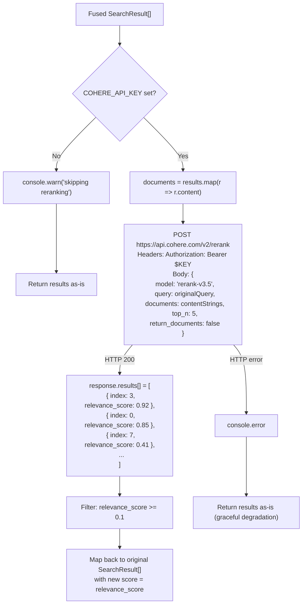

| Parameter | Value |
|-----------|-------|
| Model | `rerank-v3.5` |
| Top N | 5 (configurable via `options.topK`) |
| Relevance threshold | 0.1 (drops results below this) |
| API endpoint | `https://api.cohere.com/v2/rerank` |

Two graceful degradation paths: missing API key (logged as warning) and HTTP errors (logged as error). Both return the un-reranked results so the pipeline continues.

---

### Step 7: Answer Generation

**File:** `src/generator/index.ts`

```mermaid
graph TD
    RERANKED["Reranked SearchResult[]"]
    RERANKED --> BUILD["buildUserMessage(query, context, supplementaryContext?)"]

    BUILD --> CTX_LOOP["For each result (i = 0, 1, ...):
'[Context i+1]
Source: document_name (source_department), version
Section: section_hierarchy.join(' > ')
Page: page_number

content'"]

    CTX_LOOP --> CTX_JOIN["Join with '\\n\\n---\\n\\n'"]
    CTX_JOIN --> EXTRA{"supplementaryContext?.trim()?"}
    EXTRA -->|"Yes"| APPEND["Append:
'\\n\\nSupplementary official references:\\n' + context"]
    EXTRA -->|"No"| SKIP["Continue"]
    APPEND --> FINAL_MSG["'Retrieved regulation context:\\n\\n'
+ contextText + extraContext
+ '\\n\\n---\\n\\nQuestion: ' + query"]
    SKIP --> FINAL_MSG

    FINAL_MSG --> LLM["client.chat.completions.create({
  model: 'gpt-5.4',
  temperature: 0.1,
  max_completion_tokens: 800,
  messages: [
    { role: 'system', content: COMPLIANCE_SYSTEM_PROMPT },
    { role: 'user', content: userMessage }
  ]
})"]

    subgraph "COMPLIANCE_SYSTEM_PROMPT rules"
        R1["ONLY answer from retrieved text"]
        R2["Use supplementary refs only for freshness, never override"]
        R3["CITE: [Document Name (Dept), Version, Section X.X]"]
        R4["If context unrelated, say insufficient information"]
        R5["If partially relevant, provide what you can + note gaps"]
        R6["NEVER fabricate clause numbers or requirements"]
        R7["Note cross-references explicitly"]
        R8["Note version/edition date of cited regulations"]
        R9["Flag potentially superseded/amended regulations"]
        R10["CONCISE: 2-4 short paragraphs, under 500 words"]
    end

    LLM --> ANSWER["answer = response.choices[0].message.content"]
    ANSWER --> EXTRACT["extractCitations(answer, context)"]

    EXTRACT --> REGEX["citationRegex = /\\[([^\\]]+)\\]/g"]
    REGEX --> CIT_LOOP["For each [bracketed text]:"]
    CIT_LOOP --> MATCH{"citationText includes
ctx.document_name
or ctx.source_department?"}
    MATCH -->|"Yes"| SEC_MATCH["Extract section:
/(?:Section|Clause|Part|Table)\\s+[\\d.]+[A-Za-z]*/i"]
    SEC_MATCH --> CIT_PUSH["Push Citation {
  document_name, section, department, version, page_number
}"]
    MATCH -->|"No context match"| CIT_SKIP["Skip (unrecognized citation)"]

    EXTRACT --> GEN_RESULT["GenerationResult:
{ answer, citations[], model, prompt_tokens, completion_tokens }"]
```

**Streaming variant** (`streamAnswer`): Uses `stream: true` on the OpenAI call. Returns an `AsyncGenerator<string>` that yields `chunk.choices[0]?.delta?.content` for each SSE token. Used by `POST /api/query/stream`.

---

### Step 8: Citation Verification

**File:** `src/safety/citation-verifier.ts`

```mermaid
graph TD
    ANS["Generated answer"]
    CITS["Citation[] from extraction"]
    CTX["Reranked SearchResult[] context"]

    CITS --> CIT_LOOP["For each citation:"]
    CIT_LOOP --> V_CHECK{"Any context document where:
1. ctx.document_name === citation.document_name
OR 2. ctx.content.includes(citation.section)
OR 3. ctx.section_hierarchy.some(h =>
       h.toLowerCase().includes(
         citation.section.toLowerCase()
       ))"}
    V_CHECK -->|"Yes"| VERIFIED["verifiedCitations.push(citation)"]
    V_CHECK -->|"No"| PHANTOM["phantomCitations.push(citation)"]

    ANS --> UNCITED["findUncitedClaims(answer)"]
    UNCITED --> SPLIT["Split on /[.!?]\\s+/"]
    SPLIT --> SENT_LOOP["For each sentence:"]
    SENT_LOOP --> REG_KW{"Contains regulatory keyword?"}

    REG_KW --> KW1["/\\bmust\\b/i"]
    REG_KW --> KW2["/\\bshall\\b/i"]
    REG_KW --> KW3["/\\brequired\\b/i"]
    REG_KW --> KW4["/\\bminimum\\b/i"]
    REG_KW --> KW5["/\\bmaximum\\b/i"]
    REG_KW --> KW6["/\\bnot\\s+less\\s+than\\b/i"]
    REG_KW --> KW7["/\\bnot\\s+more\\s+than\\b/i"]
    REG_KW --> KW8["/\\bnot\\s+exceed/i"]
    REG_KW --> KW9["/\\bprescribed\\b/i"]
    REG_KW --> KW10["/\\bmandatory\\b/i"]
    REG_KW --> KW11["/\\bprohibited\\b/i"]
    REG_KW --> KW12["/\\bcompli(?:ance|ant)\\b/i"]

    REG_KW -->|"Yes"| HAS_CITE{"sentence matches /\\[[^\\]]+\\]/?"}
    HAS_CITE -->|"No + sentence.trim().length > 20"| FLAG["uncitedClaims.push(sentence)"]
    HAS_CITE -->|"Yes"| OK["Properly cited"]
    REG_KW -->|"No"| OK

    VERIFIED --> RESULT["VerificationResult:
{ totalCitations,
  verifiedCitations: verified.length,
  phantomCitations: phantom[],
  uncitedClaims: uncited[],
  citationAccuracy: verified / total (or 1 if none) }"]

    ANS --> DISCLAIMER["appendDisclaimer(answer)"]
    DISCLAIMER --> APPENDED["answer + '\\n\\n---\\n
**Disclaimer:** This information is provided for
reference purposes only and does not constitute
legal advice. Regulations may have been amended
since last ingestion. Always verify with the relevant
Hong Kong government department and consult qualified
professionals for compliance decisions.'"]
```

This is a synchronous function — no LLM calls, no async. Runs in microseconds after generation.

---

### Step 9: Faithfulness Scoring

**File:** `src/safety/faithfulness.ts`

```mermaid
graph TD
    QUERY["Original query"]
    ANSWER["Generated answer"]
    CONTEXT["Reranked SearchResult[]"]

    CONTEXT --> CTX_FMT["contextText = context.map(c =>
  '[' + c.document_name + ']\\n' + c.content
).join('\\n\\n---\\n\\n')"]

    CTX_FMT --> LLM["GPT-5-mini chat completion
response_format: { type: 'json_object' }"]

    LLM --> SYSTEM["System prompt:
'Score faithfulness 0-10:
 10 = every claim directly supported by source
 7-9 = most claims supported, minor inferences
 4-6 = some supported, significant unsupported
 1-3 = mostly unsupported/fabricated
 0 = completely fabricated

Return JSON: {
  score: number,
  reasoning: string,
  flagged_claims: string[]
}'"]

    LLM --> USER_MSG["'Source Context:\\n' + contextText +
'\\n\\nQuestion: ' + query +
'\\n\\nAnswer to evaluate:\\n' + answer"]

    LLM --> PARSE["JSON.parse(response.choices[0].message.content)"]
    PARSE --> RESULT["FaithfulnessResult:
{ score: 0-10,
  reasoning: string,
  flaggedClaims: string[] }"]

    LLM -->|"Parse error"| DEFAULT["{ score: 0,
reasoning: 'Failed to evaluate',
flaggedClaims: [] }"]
```

Runs in parallel with `logQueryAudit` via `Promise.all` — neither depends on the other. Uses `gpt-5-mini` ($0.40/1M input) instead of `gpt-5.4` ($2.50/1M input) since evaluation requires less reasoning capability than generation.

If `options.skipFaithfulness` is true, returns `{ score: -1, reasoning: 'Skipped', flaggedClaims: [] }` immediately.

---

### Step 10: Live Web Search

**File:** `src/retrieval/web-search.ts`

```mermaid
graph TD
    QUERY["Query (lowercased)"]
    QUERY --> PARALLEL["Promise.all([
  searchBDSite(query).catch(() => []),
  searchFSDSite(query).catch(() => []),
  searchGovData(query).catch(() => [])
])"]

    subgraph "searchBDSite — 20 keyword-to-URL mappings"
        BD_FN["Check query terms against keyword sets"]
        BD_FN --> BD_FIRE["['fire', 'frc', 'fire resist', 'fire safety', 'means of escape', 'compartment']
→ Code of Practice for Fire Safety in Buildings 2011"]
        BD_FN --> BD_FOUND["['foundation', 'pile', 'geotechnical', 'ground', 'excavat']
→ Code of Practice for Foundations 2017"]
        BD_FN --> BD_WIND["['wind', 'typhoon', 'lateral', 'dynamic']
→ Code of Practice on Wind Effects 2019"]
        BD_FN --> BD_CONC["['concrete', 'reinforc', 'prestress', 'durability']
→ Structural Use of Concrete 2013"]
        BD_FN --> BD_STEEL["['steel', 'weld', 'bolt', 'connection']
→ Structural Use of Steel 2011"]
        BD_FN --> BD_BFA["['barrier', 'access', 'disable', 'wheelchair', 'ramp', 'lift']
→ Barrier Free Access 2008"]
        BD_FN --> BD_MORE["... + demolition, supervision, glass, load, pnap, circular,
gfa, energy, drainage, minor work, scaffold, heritage,
mic, sustainable"]
        BD_FN -->|"Max 3 results"| BD_OUT["WebSearchResult[]"]
    end

    subgraph "searchFSDSite — 6 keyword-to-URL mappings"
        FSD_FN["Check query terms"]
        FSD_FN --> FSD_SPRINKLER["['sprinkler', 'automatic'] → FSD CoP for Minimum FSI"]
        FSD_FN --> FSD_FSI["['fire service install', 'fsi', 'fire hydrant', 'hose reel']
→ FSD CoP for Minimum Fire Service Installations"]
        FSD_FN --> FSD_DETECT["['fire detect', 'alarm', 'smoke'] → FSD TG: BS5839"]
        FSD_FN --> FSD_LIGHT["['emergency light'] → FSD TG: BS5266/EN1838"]
        FSD_FN --> FSD_EXT["['fire extinguish'] → FSD FPN 11"]
        FSD_FN --> FSD_SITE["['construction site fire'] → FSD FPN 13"]
        FSD_FN -->|"Max 2 results"| FSD_OUT["WebSearchResult[]"]
    end

    subgraph "searchGovData — 5 live API mappings"
        GOV_FN["Check query terms"]
        GOV_FN --> GOV_DOOR["'fire door' / 'doorset' → /api/gov/fire-doorsets"]
        GOV_FN --> GOV_GLASS["'fire glass' / 'glazing' → /api/gov/fire-glazing"]
        GOV_FN --> GOV_STOP["'fire stop' / 'firestop' → /api/gov/fire-stop-materials"]
        GOV_FN --> GOV_MIC["'mic' / 'modular' / 'prefab' → /api/gov/mic-systems"]
        GOV_FN --> GOV_COMP["'compliance' / 'enforcement' → /api/gov/fire-safety"]
        GOV_FN -->|"Max 2 results"| GOV_OUT["WebSearchResult[]"]
    end

    PARALLEL --> MERGE["all = [...bd, ...fsd, ...gov]"]
    MERGE --> CONTEXT_STR["supplementaryContext = all.length > 0
? '\\n\\n[Live Web Sources]\\n' +
  all.map(r => '- ' + r.title + ' (' + r.source + '): ' + r.snippet).join('\\n')
: ''"]
    MERGE --> OUTPUT["{ webResults: all, supplementaryContext }"]
```

This is pattern-based (no HTTP requests to search engines). Max 7 total results (3 BD + 2 FSD + 2 Gov). The supplementary context string is appended to the generator's user message so the LLM can reference live data links.

---

### Step 11: Audit Logging & Cost Tracking

**File:** `src/db/store.ts` + `src/observability/cost-tracker.ts`

```mermaid
graph TD
    subgraph "Audit Logging"
        AUDIT["logQueryAudit(pool, data)"]
        AUDIT --> AUDIT_SQL["INSERT INTO query_audit_log (
  query,
  filters,                    -- JSONB
  retrieved_chunk_ids,         -- UUID[]
  response,
  citations,                   -- JSONB
  faithfulness_score,          -- REAL
  citation_accuracy,           -- REAL
  model_used,
  latency_ms
) VALUES ($1, $2, $3, $4, $5, $6, $7, $8, $9)
RETURNING id"]
        AUDIT_SQL --> AUDIT_ID["Returns UUID audit ID"]
    end

    subgraph "Cost Estimation"
        COST["estimateQueryCost(options)"]
        COST --> CACHED{"options.cached?"}

        CACHED -->|"Yes"| CACHE_COST["embeddingCost = 50 tokens * $0.13/1M
totalCost = ~$0.0000065"]

        CACHED -->|"No"| FULL_COST["Breakdown:"]
        FULL_COST --> C_EXP["Expansion: 200 in + 100 out @ gpt-5-mini
= (200*0.40 + 100*1.60) / 1M = $0.00024"]
        FULL_COST --> C_EMB["Embedding: ~50 tokens @ text-embedding-3-large
= 50*0.13 / 1M = $0.0000065"]
        FULL_COST --> C_GEN["Generation: ~4000 in + ~500 out @ gpt-5.4
= (4000*2.50 + 500*15.00) / 1M = $0.0175"]
        FULL_COST --> C_FAITH["Faithfulness: ~3000 in + ~200 out @ gpt-5-mini
= (3000*0.40 + 200*1.60) / 1M = $0.00152"]

        FULL_COST --> TOTAL["Total per query: ~$0.019"]
    end

    subgraph "In-Memory Aggregate Stats"
        STATS["Tracked since server start:"]
        STATS --> S_QUERIES["totalQueries"]
        STATS --> S_COST["totalCostUsd"]
        STATS --> S_TOKENS["totalTokens"]
        STATS --> S_CACHE["cacheHits"]
        STATS --> S_STARTED["startedAt"]

        STATS --> AGG["getAggregateStats() → {
  totalQueries, totalCostUsd, averageCostUsd,
  totalTokens, cacheHits, cacheHitRate, since
}"]
    end
```

**Model pricing** (per 1M tokens, March 2026):

| Model | Input | Output |
|-------|-------|--------|
| `gpt-5.4` | $2.50 | $15.00 |
| `gpt-5-mini` | $0.40 | $1.60 |
| `text-embedding-3-large` | $0.13 | — |

---

## Live Data Services

**File:** `src/api/live-data.ts` — Real-time verification against HK government sources.

```mermaid
graph TD
    subgraph "Document Freshness Check"
        FRESH["checkDocumentFreshness(sourceUrl, name, ingestedAt)"]
        FRESH --> HEAD["fetch(sourceUrl, { method: 'HEAD',
  User-Agent: 'HK-Compliance-RAG/1.0 (freshness-check)',
  timeout: 8s })"]
        HEAD --> HEADERS["Extract:
last_modified = headers.get('last-modified')
content_length = headers.get('content-length')"]
        HEADERS --> STALE{"new Date(lastModified) > new Date(ingestedAt)?"}
        STALE -->|"Yes"| IS_STALE["is_stale: true"]
        STALE -->|"No"| IS_FRESH["is_stale: false"]
        HEAD -->|"Error"| ASSUME_FRESH["is_stale: false (assume fresh on error)"]
    end

    subgraph "New Circular Detection"
        BD_CIRC["detectNewBDCirculars(year)"]
        BD_CIRC --> BD_PROBE["Probe 7 URL patterns per year (current + previous):
CL_USFMWCS, CL_TSNCQP, CL_ASMTR,
CL_PMCSRTS, CL_ATGMWCS, CL_FSMFW, CL_TGMWCS"]
        BD_PROBE --> BD_HEAD["HEAD request per URL (8s timeout)"]
        BD_HEAD -->|"200"| BD_FOUND["Add to found[]"]
        BD_HEAD -->|"!200"| BD_SKIP["Skip"]

        FSD_CIRC["detectNewFSDCirculars(year)"]
        FSD_CIRC --> FSD_PROBE["Probe {year}_{01-10}_eng.pdf"]
        FSD_PROBE --> FSD_HEAD["HEAD request per URL (8s timeout)"]
        FSD_HEAD -->|"200"| FSD_FOUND["Add to found[]"]
        FSD_HEAD -->|"!200"| FSD_SKIP["Skip"]
    end
```

## Government Open Data Integration

**File:** `src/api/gov-data.ts` — Fetches live CSV datasets from `data.gov.hk` with 10-minute TTL cache.

```mermaid
graph TD
    subgraph "CSV Fetch Pipeline"
        REQ["fetchBDCsv(path)"]
        REQ --> CACHE_CHECK{"dataCache.get(path)?.expiresAt > now?"}
        CACHE_CHECK -->|"Hit"| CACHED["Return cached data"]
        CACHE_CHECK -->|"Miss"| FETCH["fetch('https://static.data.gov.hk/bd/opendata/' + path,
  timeout: 10s)"]
        FETCH --> TEXT["response.text()"]
        TEXT --> PARSE_CSV["parseCsv(text)"]
        PARSE_CSV --> BOM["Strip UTF-8 BOM (/^\\uFEFF/)"]
        BOM --> SPLIT_LINES["Split on '\\n'"]
        SPLIT_LINES --> HEADERS["First line → column headers"]
        SPLIT_LINES --> DATA_ROWS["Remaining lines → data rows"]
        DATA_ROWS --> FIELD_PARSE["parseCsvLine: handle quoted fields,
escaped double-quotes, commas in values"]
        FIELD_PARSE --> OBJECTS["Array of { [header]: value }"]
        OBJECTS --> SET_CACHE["dataCache.set(path, { data, expiresAt: now + 10min })"]
    end

    subgraph "5 BD Datasets"
        D1["cdbbc/cdbfrd.csv → Fire Doorsets
{ refNo, productName, manufacturer, integrityMinutes,
  insulationMinutes, testReport, validityDate }"]
        D2["cdbbc/cdbfrg.csv → Fire Glazing
{ refNo, productName, manufacturer, integrityMinutes,
  insulationMinutes, testReport }"]
        D3["cdbbm/cdbfsm.csv → Fire Stop Materials
{ refNo, productName, manufacturer, category,
  application, testStandard }"]
        D4["mic/mic.csv → MiC Systems
{ ref, manufacturer, type, modelNo, intendedUse,
  maxHeight, maxStorey, dateAccepted }"]
        D5["fso/fso.csv → Fire Safety Compliance Stats
{ type, asAt, directionsIssued, directionsComplied }"]
    end

    subgraph "GeoData Location Search"
        LOC["searchLocation(query)"]
        LOC --> GEO_API["GET geodata.gov.hk/gs/api/v1.0.0/locationSearch
?q=encodedQuery
timeout: 10s"]
        GEO_API --> GEO_RESULTS["LocationResult[]:
{ nameEN, nameCH, addressEN, addressCH, districtEN, x, y }"]
        GEO_RESULTS --> SLICE["Return first 10 results"]
    end

    subgraph "Summary Endpoint"
        SUM["fetchGovDataSummary()"]
        SUM --> ALL["Promise.all([
  fetchFireDoorsets(), fetchFireGlazing(),
  fetchFireStopMaterials(), fetchMiCSystems(),
  fetchFireSafetyCompliance()
]) — each with .catch(() => [])"]
        ALL --> SUMMARY["{ fireDoorsets: { count, sample: first 3 },
  fireGlazing: { count, sample: first 3 },
  fireStopMaterials: { count, sample: first 3 },
  micSystems: { count, sample: first 3 },
  fireSafety: { count, latest: last 4 } }"]
    end
```

---

## Database Schema

**File:** `src/db/migrate.ts` — 10 migrations, run sequentially with idempotency tracking.

```mermaid
erDiagram
    regulation_chunks {
        uuid id PK "gen_random_uuid()"
        text content "NOT NULL"
        vector_3072 embedding
        text source_department "NOT NULL"
        text document_type "NOT NULL"
        text document_name "NOT NULL"
        text version
        date effective_date
        text cap_number
        text pnap_number
        text_array section_hierarchy
        int page_number
        bool is_current "DEFAULT true"
        uuid superseded_by FK
        text content_hash "NOT NULL"
        text_array cross_references
        tsvector search_vector "GENERATED ALWAYS AS to_tsvector(content)"
        timestamptz ingested_at "DEFAULT NOW()"
        timestamptz source_fetched_at
    }

    document_versions {
        uuid id PK "gen_random_uuid()"
        text document_name "NOT NULL"
        text source_department "NOT NULL"
        text version
        text content_hash "NOT NULL"
        timestamptz fetched_at "DEFAULT NOW()"
        text status "DEFAULT 'current'"
        text pdf_url
        int chunk_count
    }

    query_audit_log {
        uuid id PK "gen_random_uuid()"
        text query "NOT NULL"
        jsonb filters
        uuid_array retrieved_chunk_ids
        text response
        jsonb citations
        real faithfulness_score
        real citation_accuracy
        text model_used
        int latency_ms
        timestamptz created_at "DEFAULT NOW()"
    }

    query_cache {
        uuid id PK "gen_random_uuid()"
        text query "NOT NULL"
        text normalized_query
        text filter_key
        vector_3072 query_embedding
        text answer "NOT NULL"
        jsonb citations
        jsonb sources
        text department
        timestamptz cached_at "DEFAULT NOW()"
    }

    scrape_log {
        uuid id PK "gen_random_uuid()"
        text source_department "NOT NULL"
        int documents_checked "DEFAULT 0"
        int documents_changed "DEFAULT 0"
        int documents_failed "DEFAULT 0"
        jsonb errors
        timestamptz started_at "DEFAULT NOW()"
        timestamptz completed_at
    }

    migrations {
        text name PK
        timestamptz applied_at "DEFAULT NOW()"
    }

    regulation_chunks ||--o{ regulation_chunks : "superseded_by"
    document_versions }o--|| regulation_chunks : "tracks versions of"
    query_audit_log }o--o{ regulation_chunks : "retrieved_chunk_ids"
```

**Indexes:**

| Index | Type | Column(s) | Purpose |
|-------|------|-----------|---------|
| `idx_chunks_search` | GIN | `search_vector` | Full-text keyword search (`@@` operator) |
| `idx_chunks_dept_type` | B-tree | `source_department, document_type` | Department + type filter queries |
| `idx_chunks_current` | B-tree | `is_current` | Fast exclusion of superseded chunks |
| `idx_chunks_cap` | B-tree | `cap_number` | Cap. number filter queries |
| `idx_query_cache_embedding` | HNSW | `query_embedding vector_cosine_ops` | Semantic cache nearest-neighbor search |
| `idx_query_cache_exact_lookup` | B-tree | `normalized_query, filter_key, cached_at DESC` | Exact cache lookup with TTL ordering |

**Extensions required:** `vector` (pgvector), `uuid-ossp`, `pgcrypto`

**Connection pool:** `pg.Pool` with `max: 10` connections, singleton via `getPool()` in `src/db/pool.ts`.

---

## Concurrency & Parallelism

```mermaid
graph TD
    subgraph "Ingest Pipeline Parallelism"
        I_BATCH["ingestSources(sources, concurrency=2)"]
        I_BATCH --> I_P1["Source A → fetch → parse → chunk → embed → store"]
        I_BATCH --> I_P2["Source B → fetch → parse → chunk → embed → store"]
        I_P1 --> I_NEXT["Next batch of 2"]
        I_P2 --> I_NEXT

        I_EMBED["embedChunks: 100 chunks per API call"]
        I_STORE["storeChunks: 10 chunks per INSERT"]
    end

    subgraph "Query Pipeline Parallelism"
        Q_START["queryPipeline()"]
        Q_START --> Q_PAR1["Promise.all (stage 1)"]
        Q_PAR1 --> Q_HYBRID["hybridSearch(primary query)"]
        Q_PAR1 --> Q_EXPAND["expandQuery()"]
        Q_PAR1 --> Q_WEB["liveWebSearch()"]

        Q_HYBRID --> Q_INNER["Promise.all (inner)"]
        Q_INNER --> Q_VEC["vectorSearch()"]
        Q_INNER --> Q_KW["keywordSearch()"]

        Q_WEB --> Q_WEB_INNER["Promise.all (inner)"]
        Q_WEB_INNER --> Q_BD["searchBDSite()"]
        Q_WEB_INNER --> Q_FSD["searchFSDSite()"]
        Q_WEB_INNER --> Q_GOV["searchGovData()"]

        Q_EXPAND --> Q_EXTRA["Promise.all (expanded queries)"]
        Q_EXTRA --> Q_H2["hybridSearch(variant 1)"]
        Q_EXTRA --> Q_H3["hybridSearch(variant 2)"]

        Q_START --> Q_PAR2["Promise.all (stage 2 — post-generation)"]
        Q_PAR2 --> Q_FAITH["scoreFaithfulness()"]
        Q_PAR2 --> Q_AUDIT["logQueryAudit()"]

        Q_START --> Q_FIRE["Fire-and-forget"]
        Q_FIRE --> Q_CACHE["writeCache().catch(() => {})"]
    end

    subgraph "Scheduler Parallelism"
        S_CHECK["checkForChanges(sources, concurrency=3)"]
        S_CHECK --> S_BATCH["Promise.allSettled(batch of 3)"]
        S_BATCH --> S1["fetchPdf(source1) → compare hash"]
        S_BATCH --> S2["fetchPdf(source2) → compare hash"]
        S_BATCH --> S3["fetchPdf(source3) → compare hash"]
    end
```

---

## Graceful Degradation Map

| Component | Failure Scenario | Fallback Behavior | Code Location |
|-----------|-----------------|-------------------|---------------|
| Cohere Rerank | Missing `COHERE_API_KEY` | Return un-reranked results + console.warn | `reranker.ts:30-34` |
| Cohere Rerank | HTTP error response | Return un-reranked results + console.error | `reranker.ts:57-59` |
| Exact cache | DB query error | Return null → proceed to semantic cache | `semantic-cache.ts:82-84` |
| Semantic cache | DB/embedding error | Return null → proceed to full pipeline | `semantic-cache.ts:117-119` |
| Cache write | INSERT/UPDATE error | Silently ignored (`.catch(() => {})`) | `query.ts:213` |
| Web search (BD) | Any error | Return `[]` (`.catch(() => [])`) | `web-search.ts:128-132` |
| Web search (FSD) | Any error | Return `[]` (`.catch(() => [])`) | `web-search.ts:128-132` |
| Web search (Gov) | Any error | Return `[]` (`.catch(() => [])`) | `web-search.ts:128-132` |
| Follow-up context | LLM error | Return original query (`.catch(() => query)`) | `query.ts:57-60` |
| Query embedding | OpenAI error | `undefined` → hybrid search embeds internally | `query.ts:96-98` |
| Faithfulness | `skipFaithfulness: true` | Return `{ score: -1, reasoning: 'Skipped' }` | `query.ts:187` |
| DNS resolution | Native DNS failure on `.gov.hk` | Cloudflare DoH via `cloudflare-dns.com` | `scraper/index.ts:13-35` |
| Migrations | Error on startup | Non-blocking, server continues | `server.ts:141-143` |
| Cache table init | Error on startup | Non-blocking, server continues | `server.ts:149-151` |
| Scheduler init | Error on startup | Non-blocking, server continues | `server.ts:156-158` |
| Gov data fetch | HTTP error or timeout | Return `[]` or throw (caught by route handler) | `gov-data.ts:128-136` |
| Individual scrape source | fetch/DB error | `Promise.allSettled` continues batch, error logged | `scheduler/index.ts:43-74` |
| Live freshness check | HEAD request error | `is_stale: false` (assume fresh) | `live-data.ts:65-75` |
