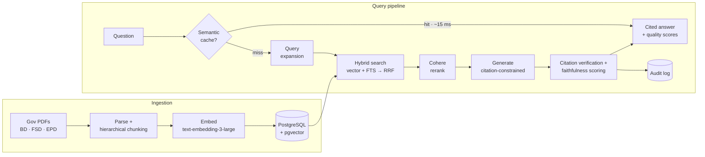
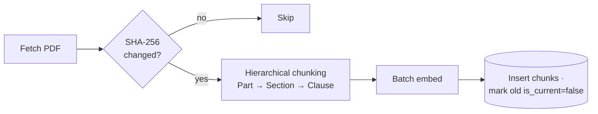

# Ordinance

**Ask Hong Kong's building regulations a question. Get a cited, verified, faithfulness-scored answer.**

[](https://github.com/manik-soin/ordinance/actions/workflows/ci.yml)


Hong Kong's building and fire regulations are scattered across hundreds of PDFs from three government departments, each with its own numbering schemes, cross-references, and update cycles. Ordinance ingests the official corpus and answers regulatory questions with citations that are verified against the retrieved sources — because in compliance, a confident wrong answer is worse than no answer.

| 📄 224 documents | 🧩 5,700+ chunks | 🏛️ 3 departments (BD · FSD · EPD) | ⚡ ~8 s full pipeline | 🚀 ~15 ms cached (≈500×) |
| :-: | :-: | :-: | :-: | :-: |

**Project page:** [maniksoin.com/projects/ordinance](https://maniksoin.com/projects/ordinance) · **Engineering write-ups:** [the RAG build](https://maniksoin.com/blog/building-rag-for-hk-regulations) · [the agent rebuild](https://maniksoin.com/blog/from-rag-to-agent-harnessing-ordinance) · **Deep dive:** [HK-COMPLIANCE-GUIDE.md](./HK-COMPLIANCE-GUIDE.md)

## Architecture



## What it does

| Capability | How |
| --- | --- |
| 🔍 **Hybrid retrieval** | pgvector cosine similarity + PostgreSQL full-text search, fused with Reciprocal Rank Fusion, optionally reranked by Cohere `rerank-v3.5` |
| 🧾 **Verified citations** | Every bracketed citation is cross-checked against the chunks actually retrieved; phantom citations are flagged, uncited regulatory claims detected |
| ⚖️ **Faithfulness scoring** | An independent LLM judge scores each answer 0–10 against its sources before it reaches the user |
| 🗂️ **Structure-aware ingestion** | Part → Section → Clause hierarchy preserved through chunking; SHA-256 change detection re-ingests only what changed |
| ⚡ **Two-level caching** | Exact-match + semantic cache (0.95 cosine threshold) drop repeat queries from ~8 s to ~15 ms |
| 🌐 **Live government data** | Freshness probes and open-data lookups against `data.gov.hk` / `geodata.gov.hk` for approvals that change faster than the PDFs |
| 📡 **Streaming** | Answers stream over SSE to the browser client in `public/index.html`, with web sources appended off the critical path |
| 📜 **Audit trail** | Every query logged with citations, scores, latency, and cost |

The server is an Express 5 app that auto-runs DB migrations on boot, ensures the semantic cache table exists, serves the API under `/api`, serves the SPA from `public/`, and rate-limits `/api/query*` to 30 requests/minute/IP.

## Stack

- Runtime: Node.js 20+ with TypeScript and ESM
- API server: Express 5
- Database: PostgreSQL + `pgvector`
- Embeddings: `text-embedding-3-large` (3072 dimensions)
- Generation: `gpt-4o`
- Query expansion and faithfulness judge: OpenAI chat models
- Reranking: Cohere `rerank-v3.5` when `COHERE_API_KEY` is set
- Deployment: Railway (`railway.toml`) + Neon/Postgres

## Environment Variables

Copy `.env.example` to `.env`:

```bash
cp .env.example .env
```

Required:

- `OPENAI_API_KEY`
- `DATABASE_URL`

Optional:

- `COHERE_API_KEY`: enables reranking; the app degrades cleanly without it
- `PORT`: defaults to `3000`
- `NODE_ENV`: `development`, `production`, or `test`
- `SCRAPE_CONCURRENCY`: defaults to `3`
- `PDF_STORAGE_DIR`: defaults to `./data/pdfs`

Database notes:

- The DB user must be able to create `vector`, `uuid-ossp`, and `pgcrypto` extensions.
- The server runs migrations automatically, but you can also apply them manually with `npm run migrate`.

## Local Development

Install and run:

```bash
npm install
npm run migrate
npm run scrape
npm run dev
```

The API will be available on `http://localhost:3000` unless `PORT` is overridden.

## Ingestion Workflows



<details>
<summary><b>Ingestion scripts</b></summary>

- `npm run scrape`: ingest the curated BD code/design-manual starter set
- `npm run scrape:all`: ingest the broader BD corpus including PNAPs, JPNs, and circulars
- `npm run scrape:extra`: ingest additional BD/FSD sources not covered by the starter set
- `npm run scrape:epd`: ingest EPD noise-control sources
- `npm run ingest -- <pdf-path> [department] [name]`: manually ingest a local PDF

</details>

## Query Pipeline

`POST /api/query` runs the full non-streaming pipeline:

1. Semantic cache lookup in `query_cache`
2. Query expansion
3. Hybrid retrieval: vector similarity + PostgreSQL full-text search
4. Reciprocal Rank Fusion
5. Optional Cohere rerank
6. Answer generation with citation-constrained system prompt
7. Citation verification
8. Faithfulness scoring
9. Audit log write
10. Cache write

Important behavior:

- Non-streaming queries also pass supplementary official web references into generation when live government resources are matched.
- Streaming queries keep web search off the critical path and emit `web_sources` after answer tokens to preserve faster time-to-first-byte.
- The health endpoint intentionally returns HTTP `200` even when DB connectivity is degraded so Railway health checks do not flap.

## API Surface

<details>
<summary><b>Core query/data endpoints</b></summary>

- `POST /api/query`
- `POST /api/query/stream`
- `GET /api/health`
- `GET /api/sources`
- `GET /api/documents`
- `GET /api/audit/:id`

</details>

<details>
<summary><b>Live monitoring endpoints</b></summary>

- `GET /api/live/freshness`
- `GET /api/live/new-circulars`
- `GET /api/live/status`

</details>

<details>
<summary><b>Government open-data endpoints</b></summary>

- `GET /api/gov/summary`
- `GET /api/gov/fire-doorsets`
- `GET /api/gov/fire-glazing`
- `GET /api/gov/fire-stop-materials`
- `GET /api/gov/mic-systems`
- `GET /api/gov/fire-safety`
- `GET /api/gov/location?q=<query>`

</details>

<details>
<summary><b>Admin endpoints</b></summary>

- `POST /api/admin/scrape`
- `GET /api/admin/changes`
- `GET /api/admin/costs`

Operational note: `POST /api/admin/scrape` currently performs change detection for the BD starter set and records version metadata. Full re-ingestion is still driven by the CLI scripts.

</details>

## Testing

```bash
npm run lint
npm test
npm run test:unit
npm run test:integration
npm run test:evals
npm run test:coverage
npm run build
```

Current CI behavior:

- GitHub Actions runs typecheck, unit tests, and coverage.
- Integration tests and evals are available locally, but are not part of CI because they need a live database and API keys.

## Deployment

Railway is configured through [railway.toml](./railway.toml):

- builder: `NIXPACKS`
- build command: `npx tsc`
- start command: `node dist/server.js`
- health check path: `/api/health`
- Node version: `22`

Typical deploy flow:

```bash
npm run lint
npm test
npm run build
git push origin main
railway redeploy
```

The server will apply migrations on boot, then create the semantic cache table if needed.

## Repo Layout

```text
src/api           HTTP routes plus live/open-data integrations
src/cache         semantic query cache
src/cli           ingestion entrypoints
src/db            migrations, pool, persistence helpers
src/generator     answer generation and streaming
src/pipeline      query and ingestion orchestration
src/retrieval     hybrid search, reranking, query expansion, web lookup
src/safety        prompt-injection checks, citation verification, faithfulness
src/scheduler     cron-based change-detection helpers
src/sources       curated source definitions
public/           single-file frontend
tests/            unit, integration, and eval suites
```

## Known Operational Caveats

- The scheduler module exists, but the web server does not automatically start cron jobs.
- Live-data probes rely on upstream government URL conventions and may miss newly published documents if naming patterns change.
- Admin endpoints are application-level admin surfaces; if you expose this beyond a trusted environment, protect them at the edge or add auth.

## License

MIT
